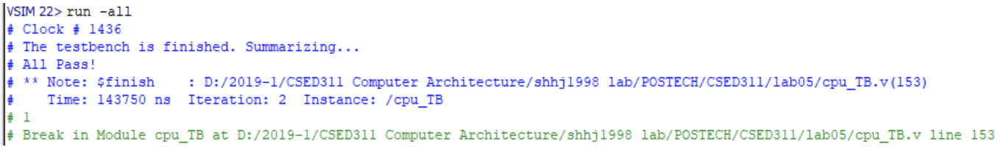
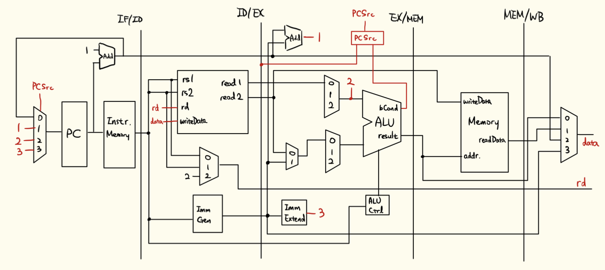

# Pipelined CPU
Verilog implementation of pipelined CPU for TSC instructions.

It is solution of POSTECH CSED311(Computer Architecture) assignment. If you're participant of this class, ***don't copy this!***

  

## TSC
TSC is an ISA(Instruction Set Architecture) for this assignment.
It is simple than RISC-V.

You can see more details [here](media/manual.pdf).

## Structure
If you're only interested in main implementation, you only need to see `CPU` files.
Others are used for implementing the benchmark testing.

### CPU
- `cpu.v`: Implementation of pipelined CPU
- `ALU.v`: Implementation of ALU(Arithmetic Logic Unit)
- `opcodes.v`: Constants of operation codes

### Test
- `Memory.v`: Implementation of memory that is accessed by CPU
- `cpu_TB.v`: Runs benchmark instructions on our CPU implementation
- `testbench.asm`: Machine language representation of benchmark instructions

## Design

  

## Collaborators
- [seunghyukcho](https://github.com/seunghyukcho)
- [k0nen](https://github.com/k0nen)
